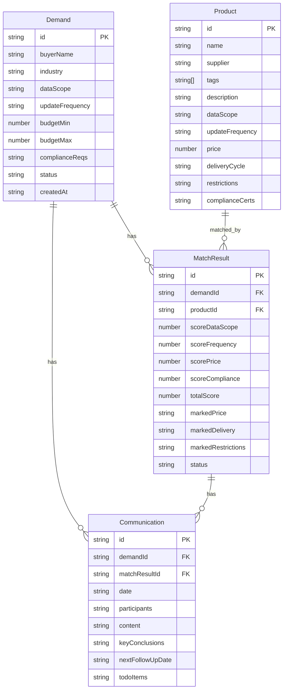

## 1. 架构设计

```mermaid
flowchart TB
    subgraph "前端应用"
        "React + TypeScript + Tailwind CSS"
        "Zustand 状态管理"
        "React Router 路由"
    end
    subgraph "数据层"
        "LocalStorage 持久化"
        "Mock 数据集"
    end
    "前端应用" --> "数据层"
```

纯前端应用，使用 LocalStorage 做数据持久化，不依赖后端服务。

## 2. 技术说明

- 前端：React@18 + TypeScript + Tailwind CSS@3 + Vite
- 初始化工具：vite-init
- 后端：无（纯前端应用，数据存储于 LocalStorage）
- 数据库：无（使用 Zustand + LocalStorage 持久化方案）

## 3. 路由定义

| 路由 | 用途 |
|------|------|
| / | 主布局，左侧导航 + 内容区 |
| /demands | 需求录入页面，含需求表单与列表 |
| /products | 产品库浏览页面，含标签筛选与产品网格 |
| /matching | 匹配工作台页面，含候选产品、评分与方案对比 |
| /communications | 沟通记录页面，含纪要表单与时间线 |
| /report | 撮合报告页面，含推荐清单与报告导出 |

## 4. API定义

无后端API，使用前端 Zustand Store 管理所有数据。

## 5. 服务器架构图

不适用（纯前端应用）

## 6. 数据模型

### 6.1 数据模型定义



### 6.2 数据定义语言

使用 TypeScript 接口定义：

```typescript
interface Demand {
  id: string;
  buyerName: string;
  industry: string;
  dataScope: string;
  updateFrequency: string;
  budgetMin: number;
  budgetMax: number;
  complianceReqs: string;
  status: 'pending' | 'matching' | 'completed';
  createdAt: string;
}

interface Product {
  id: string;
  name: string;
  supplier: string;
  tags: string[];
  description: string;
  dataScope: string;
  updateFrequency: string;
  price: number;
  deliveryCycle: string;
  restrictions: string;
  complianceCerts: string[];
}

interface MatchResult {
  id: string;
  demandId: string;
  productId: string;
  scoreDataScope: number;
  scoreFrequency: number;
  scorePrice: number;
  scoreCompliance: number;
  totalScore: number;
  markedPrice: string;
  markedDelivery: string;
  markedRestrictions: string;
  status: 'candidate' | 'shortlisted' | 'recommended' | 'rejected';
}

interface Communication {
  id: string;
  demandId: string;
  matchResultId: string;
  date: string;
  participants: string;
  content: string;
  keyConclusions: string;
  nextFollowUpDate: string;
  todoItems: string[];
}
```
